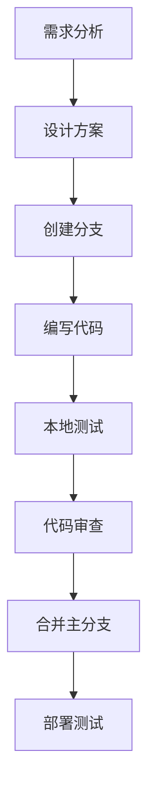

# 🛠️ 开发指南

## 📋 目录
- [开发环境设置](#开发环境设置)
- [项目结构说明](#项目结构说明)
- [开发工作流](#开发工作流)
- [代码规范](#代码规范)
- [调试技巧](#调试技巧)

## 🚀 开发环境设置

### 系统要求
- **Node.js**: >= 18.0.0
- **npm**: >= 8.0.0
- **现代浏览器**: Chrome 90+, Firefox 88+, Safari 14+

### 快速开始
```bash
# 1. 克隆项目
git clone https://github.com/9531lyj/space-battle-game.git
cd space-battle-game

# 2. 安装依赖
npm install

# 3. 启动开发服务器
npm run dev

# 4. 打开浏览器访问
# http://localhost:5173
```

### 开发工具推荐
```
IDE/编辑器:
├── Visual Studio Code (推荐)
├── WebStorm
└── Sublime Text

浏览器扩展:
├── Three.js Developer Tools
├── Vue.js devtools (用于调试)
└── Performance Monitor

调试工具:
├── Chrome DevTools
├── Three.js Inspector
└── Stats.js (性能监控)
```

## 📁 项目结构说明

### 目录结构
```
space-battle-game/
├── docs/                    # 📚 项目文档
│   ├── ARCHITECTURE.md      # 架构设计文档
│   ├── DEPENDENCIES.md      # 依赖分析文档
│   ├── WORKFLOW.md          # 流程结构文档
│   └── DEVELOPMENT.md       # 开发指南文档
├── public/                  # 🌐 静态资源
│   └── vite.svg            # 网站图标
├── src/                     # 💻 源代码
│   ├── game/               # 🎮 游戏核心模块
│   │   ├── GameWorld.ts    # 游戏世界管理
│   │   ├── Player.ts       # 玩家系统
│   │   ├── Enemy.ts        # 敌机AI系统
│   │   ├── Projectile.ts   # 炮弹系统
│   │   ├── Controls.ts     # 控制系统
│   │   └── Crosshair.ts    # 瞄准镜系统
│   ├── main.ts             # 🚀 主入口文件
│   ├── style.css           # 🎨 样式文件
│   └── vite-env.d.ts       # TypeScript环境声明
├── index.html              # 📄 主页面
├── package.json            # 📦 项目配置
├── tsconfig.json           # ⚙️ TypeScript配置
├── README.md               # 📖 项目说明
└── .gitignore             # 🚫 Git忽略文件
```

### 模块职责划分
```
核心模块:
├── GameWorld.ts
│   ├── 3D场景管理
│   ├── 光照系统
│   ├── 渲染控制
│   └── 环境效果
├── Player.ts
│   ├── 飞机控制
│   ├── 技能系统
│   ├── 状态管理
│   └── 武器系统
├── Enemy.ts
│   ├── AI行为
│   ├── 移动模式
│   ├── 攻击逻辑
│   └── 生命周期
├── Crosshair.ts
│   ├── 瞄准检测
│   ├── 目标锁定
│   ├── 精度计算
│   └── UI显示
└── Controls.ts
    ├── 输入处理
    ├── 事件管理
    ├── 指令转换
    └── 状态同步
```

## 🔄 开发工作流

### 1. 功能开发流程


### 2. Git工作流
```bash
# 创建功能分支
git checkout -b feature/new-weapon-system

# 开发过程中的提交
git add .
git commit -m "feat: add laser weapon system"

# 推送到远程
git push origin feature/new-weapon-system

# 合并到主分支
git checkout main
git merge feature/new-weapon-system
git push origin main
```

### 3. 测试流程
```bash
# 启动开发服务器
npm run dev

# 构建生产版本
npm run build

# 预览生产版本
npm run preview

# 类型检查
npx tsc --noEmit
```

## 📝 代码规范

### TypeScript规范
```typescript
// ✅ 好的实践
class Player {
  private readonly maxHealth: number = 100;
  private health: number;
  
  constructor() {
    this.health = this.maxHealth;
  }
  
  public takeDamage(amount: number): void {
    this.health = Math.max(0, this.health - amount);
  }
}

// ❌ 避免的写法
class Player {
  health: any = 100; // 避免使用any
  
  takeDamage(amount) { // 缺少类型注解
    this.health -= amount;
  }
}
```

### 命名规范
```typescript
// 类名: PascalCase
class GameWorld { }
class EnemyAI { }

// 方法名: camelCase
public updatePosition(): void { }
private calculateDistance(): number { }

// 常量: UPPER_SNAKE_CASE
const MAX_ENEMIES = 10;
const DEFAULT_SPEED = 5;

// 接口: PascalCase + I前缀
interface ISkill {
  name: string;
  cooldown: number;
}
```

### 文件组织规范
```typescript
// 导入顺序
import * as THREE from 'three';           // 第三方库
import { Player } from './Player';        // 本地模块
import { GameConfig } from '../config';   // 配置文件

// 导出规范
export class GameWorld { }               // 默认导出类
export interface GameConfig { }         // 导出接口
export const DEFAULT_CONFIG = { };      // 导出常量
```

## 🐛 调试技巧

### 1. Three.js调试
```typescript
// 添加辅助工具
const axesHelper = new THREE.AxesHelper(5);
scene.add(axesHelper);

// 显示包围盒
const box = new THREE.Box3().setFromObject(mesh);
const helper = new THREE.Box3Helper(box, 0xffff00);
scene.add(helper);

// 性能监控
import Stats from 'three/examples/jsm/libs/stats.module.js';
const stats = Stats();
document.body.appendChild(stats.dom);

function animate() {
  stats.begin();
  // 渲染代码
  stats.end();
}
```

### 2. 控制台调试
```typescript
// 调试信息输出
console.group('Player Status');
console.log('Position:', player.position);
console.log('Health:', player.health);
console.log('Energy:', player.energy);
console.groupEnd();

// 性能测量
console.time('Enemy Update');
enemies.forEach(enemy => enemy.update(deltaTime));
console.timeEnd('Enemy Update');
```

### 3. 可视化调试
```typescript
// 显示射线
const raycaster = new THREE.Raycaster();
const arrowHelper = new THREE.ArrowHelper(
  raycaster.ray.direction,
  raycaster.ray.origin,
  100,
  0xff0000
);
scene.add(arrowHelper);

// 显示碰撞检测
function visualizeCollision(object1, object2) {
  const material = new THREE.MeshBasicMaterial({
    color: 0xff0000,
    wireframe: true
  });
  // 创建可视化网格
}
```

## ⚡ 性能优化

### 1. 渲染优化
```typescript
// 对象池模式
class ProjectilePool {
  private pool: Projectile[] = [];
  
  public get(): Projectile {
    return this.pool.pop() || new Projectile();
  }
  
  public release(projectile: Projectile): void {
    projectile.reset();
    this.pool.push(projectile);
  }
}

// 批量渲染
const instancedMesh = new THREE.InstancedMesh(
  geometry,
  material,
  maxInstances
);
```

### 2. 内存管理
```typescript
// 及时清理资源
function dispose() {
  geometry.dispose();
  material.dispose();
  texture.dispose();
  renderer.dispose();
}

// 避免内存泄漏
function removeFromScene(object: THREE.Object3D) {
  scene.remove(object);
  object.traverse((child) => {
    if (child instanceof THREE.Mesh) {
      child.geometry.dispose();
      child.material.dispose();
    }
  });
}
```

## 🔧 常见问题解决

### 1. 性能问题
```
问题: 帧率下降
解决方案:
├── 减少渲染对象数量
├── 使用LOD (Level of Detail)
├── 启用视锥剔除
└── 优化材质和纹理
```

### 2. 内存泄漏
```
问题: 内存持续增长
解决方案:
├── 及时dispose几何体和材质
├── 移除事件监听器
├── 清理定时器
└── 使用对象池
```

### 3. 输入延迟
```
问题: 控制响应慢
解决方案:
├── 优化事件处理逻辑
├── 减少主线程阻塞
├── 使用requestAnimationFrame
└── 避免同步操作
```

## 📚 学习资源

### 官方文档
- [Three.js官方文档](https://threejs.org/docs/)
- [Three.js示例](https://threejs.org/examples/)
- [TypeScript官方文档](https://www.typescriptlang.org/docs/)

### 推荐教程
- [Three.js Journey](https://threejs-journey.com/)
- [Three.js Fundamentals](https://threejsfundamentals.org/)
- [WebGL Fundamentals](https://webglfundamentals.org/)

### 社区资源
- [Three.js论坛](https://discourse.threejs.org/)
- [Stack Overflow](https://stackoverflow.com/questions/tagged/three.js)
- [GitHub Issues](https://github.com/mrdoob/three.js/issues)

## 🤝 贡献指南

### 提交规范
```
feat: 新功能
fix: 错误修复
docs: 文档更新
style: 代码格式
refactor: 重构
test: 测试相关
chore: 构建工具
```

### Pull Request流程
1. Fork项目
2. 创建功能分支
3. 编写代码和测试
4. 提交Pull Request
5. 代码审查
6. 合并到主分支
