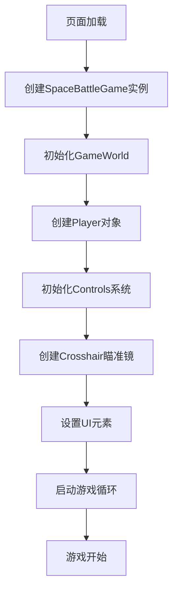
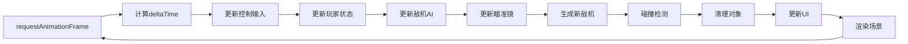
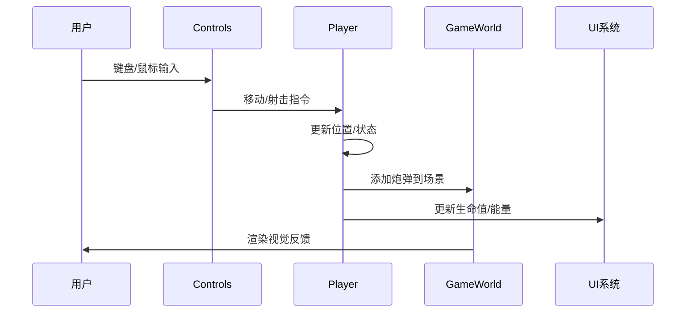
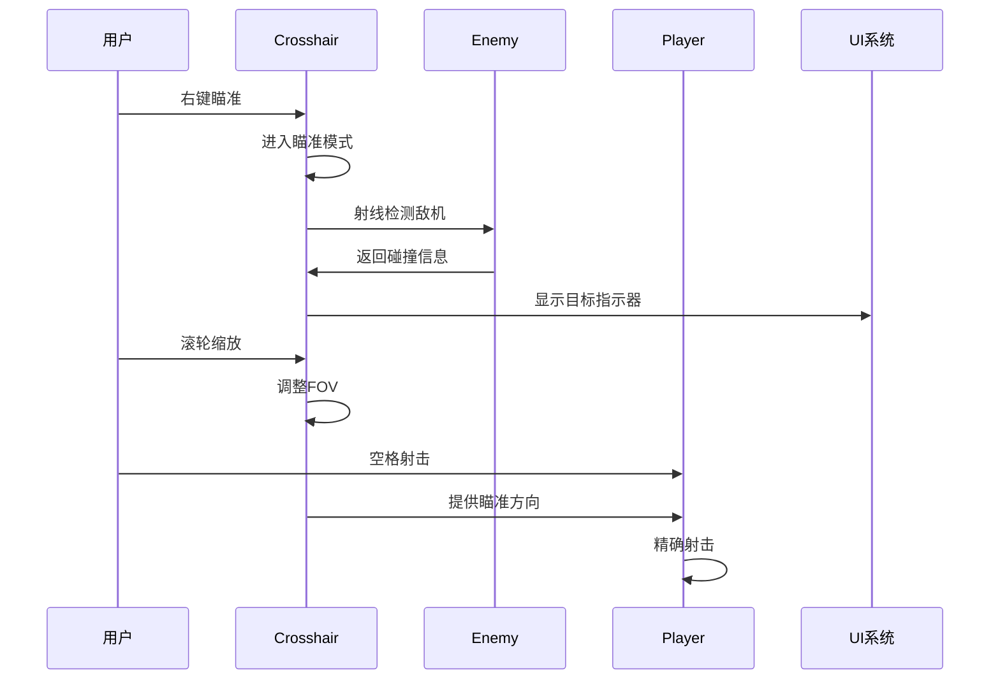
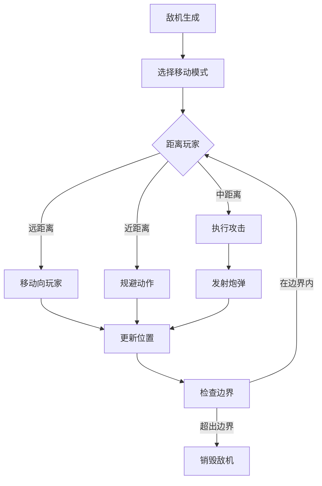
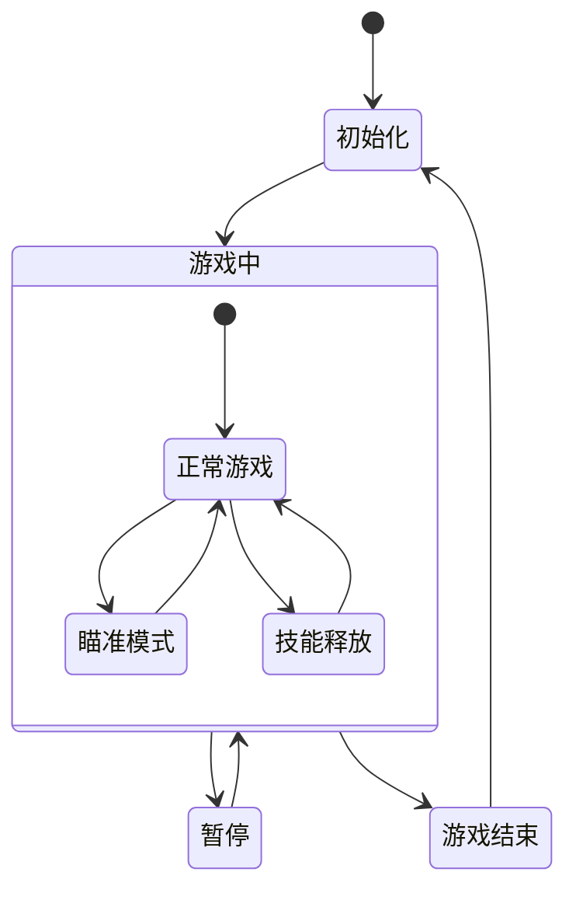
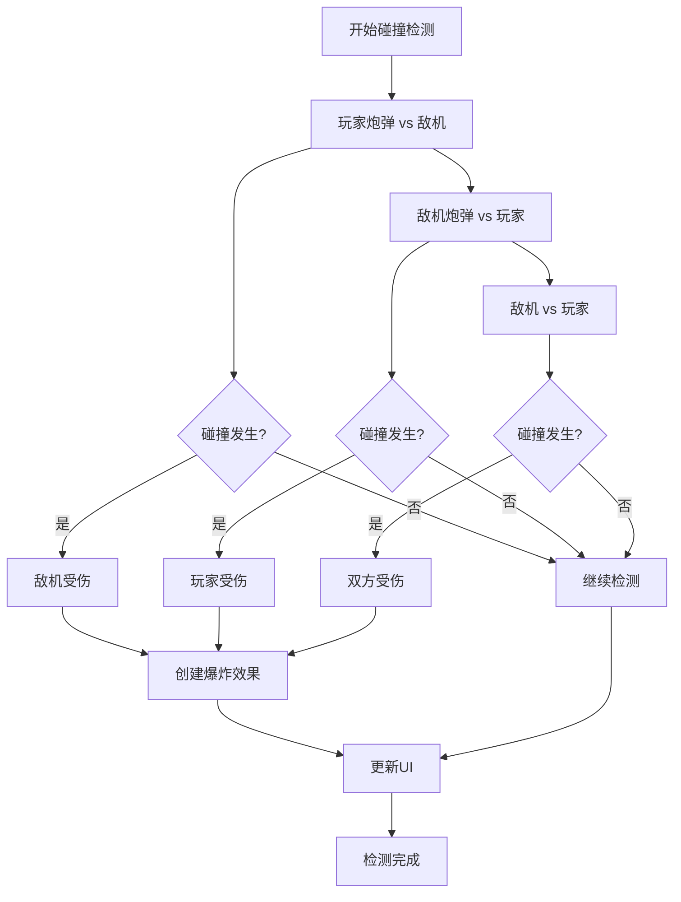
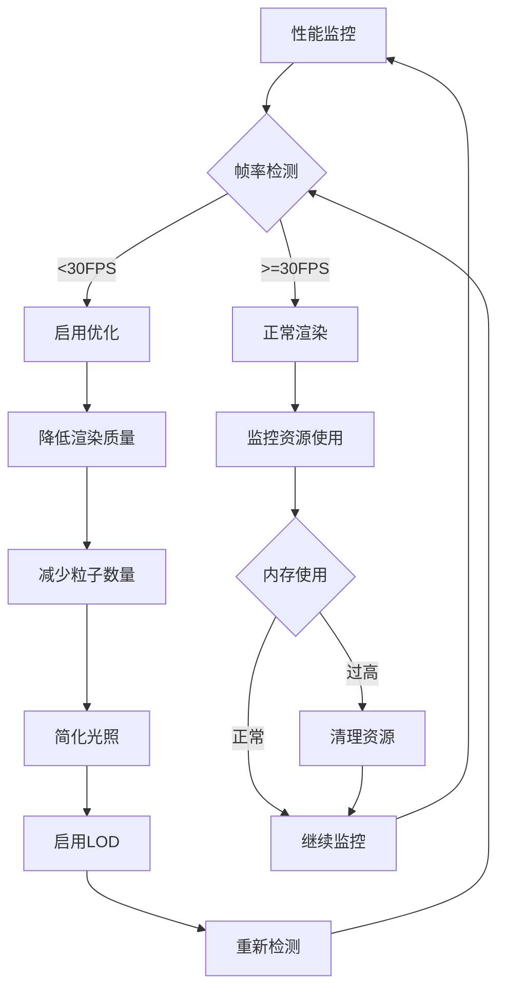

# 🔄 游戏流程结构文档

## 📋 目录
- [游戏生命周期](#游戏生命周期)
- [核心游戏循环](#核心游戏循环)
- [系统交互流程](#系统交互流程)
- [状态管理流程](#状态管理流程)
- [事件处理流程](#事件处理流程)

## 🎮 游戏生命周期

### 初始化阶段


### 详细初始化流程
```
1. 页面加载完成
   ├── 获取Canvas元素
   ├── 初始化Three.js场景
   └── 设置渲染器参数

2. 创建游戏世界
   ├── 初始化3D场景
   ├── 设置相机参数
   ├── 配置光照系统
   └── 生成星空背景

3. 创建游戏对象
   ├── 实例化玩家飞机
   ├── 初始化技能系统
   ├── 设置控制系统
   └── 创建瞄准镜

4. 启动游戏
   ├── 开始游戏循环
   ├── 启用事件监听
   └── 显示游戏界面
```

## 🔄 核心游戏循环

### 主循环结构


### 详细循环步骤
```typescript
gameLoop() {
  // 1. 时间计算
  const currentTime = performance.now();
  const deltaTime = (currentTime - this.lastTime) / 1000;
  
  // 2. 输入处理
  this.controls.update();
  
  // 3. 游戏逻辑更新
  this.player.update(deltaTime);
  this.updateEnemies(deltaTime);
  this.crosshair.update(this.enemies, this.player.position);
  
  // 4. 游戏机制
  this.spawnEnemies();
  this.checkCollisions();
  this.cleanup();
  
  // 5. 界面更新
  this.updateUI();
  
  // 6. 渲染
  this.gameWorld.render();
  
  // 7. 下一帧
  requestAnimationFrame(() => this.gameLoop());
}
```

## 🎯 系统交互流程

### 玩家操作流程


### 瞄准镜系统流程


### 敌机AI流程


## 📊 状态管理流程

### 玩家状态管理
```
玩家状态 {
  ├── 基础属性
  │   ├── 位置 (position)
  │   ├── 速度 (velocity)
  │   ├── 生命值 (health)
  │   └── 能量 (energy)
  ├── 技能状态
  │   ├── 技能冷却时间
  │   ├── 技能能量消耗
  │   └── 技能效果持续时间
  └── 武器状态
      ├── 射击冷却
      ├── 武器类型
      └── 弹药数量
}
```

### 游戏状态转换


## ⚡ 事件处理流程

### 输入事件处理
```mermaid
graph TD
    A[DOM事件] --> B{事件类型}
    B -->|键盘事件| C[keydown/keyup]
    B -->|鼠标事件| D[mousedown/mouseup/mousemove]
    B -->|滚轮事件| E[wheel]
    
    C --> F[更新按键状态]
    D --> G[更新鼠标状态]
    E --> H[处理缩放]
    
    F --> I[Controls.update()]
    G --> I
    H --> I
    
    I --> J[转换为游戏指令]
    J --> K[执行游戏逻辑]
```

### 碰撞检测流程


## 🎨 渲染流程

### 渲染管道
```
1. 场景准备
   ├── 更新对象变换矩阵
   ├── 计算光照参数
   └── 准备材质和纹理

2. 视锥剔除
   ├── 计算相机视锥
   ├── 剔除不可见对象
   └── 优化渲染列表

3. 渲染执行
   ├── 清空帧缓冲
   ├── 渲染不透明对象
   ├── 渲染透明对象
   └── 后处理效果

4. UI渲染
   ├── 更新HTML元素
   ├── 处理CSS动画
   └── 同步状态显示
```

### 性能优化流程


## 🔧 错误处理流程

### 异常处理策略
```
1. 输入验证
   ├── 参数类型检查
   ├── 边界值验证
   └── 空值处理

2. 运行时错误
   ├── Try-Catch包装
   ├── 错误日志记录
   └── 优雅降级

3. 资源加载错误
   ├── 重试机制
   ├── 备用资源
   └── 用户提示

4. 性能问题
   ├── 自动优化
   ├── 警告提示
   └── 功能降级
```

## 📈 性能监控流程

### 实时监控指标
```
性能指标 {
  ├── 渲染性能
  │   ├── FPS (帧率)
  │   ├── 渲染时间
  │   └── GPU使用率
  ├── 内存使用
  │   ├── 堆内存
  │   ├── GPU内存
  │   └── 对象数量
  └── 游戏逻辑
      ├── 更新时间
      ├── 碰撞检测时间
      └── AI计算时间
}
```

这个流程结构确保了游戏的稳定运行和良好的用户体验。
